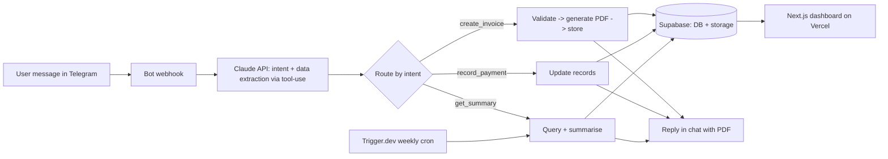

# Conversational Back-Office Agent — Build Spec

*A skill-building clone of "Ovira": run a business from a chat app. Working name — pick your own (e.g. ChatLedger, DeskMate). This spec is written to be executed in Claude Code, phase by phase.*

---

## What you're cloning

A business owner messages a bot in plain language:

> "Generate an invoice for ABC Company for £250,000 consulting services."

Within seconds the system: parses the request, generates a branded PDF invoice with the owner's business details, stores it, files the record, and replies in chat with the PDF. A web dashboard shows all invoices, payments, and records, and a scheduled job sends a weekly business summary back through the chat.

That's the whole product. It looks like magic but it's six well-understood parts wired together.

## Why this is the right skill project for you

It consolidates, in one build, every skill across your programme:

- **LLM tool-use / structured extraction** — the heart of it (turning free text into validated structured data).
- **Conversational interface** — Telegram, then WhatsApp (your Track E).
- **Document generation** — HTML → PDF.
- **Database + storage + auth** — Supabase (your Phase 4).
- **Full-stack dashboard** — Next.js on Vercel (your Phase 4).
- **Scheduled automation** — Trigger.dev weekly summaries (your Phase 3).
- **Reliability + security** — validation, guardrails, multi-tenant isolation, audit logging (your DevSecOps edge, and Track F).

Because it handles money and personal data, it's also a legitimate showcase for the production discipline that sets you apart — which makes the finished version a genuine portfolio / resume piece (see the last section).

---

## Architecture at a glance



**The core insight:** the LLM does *not* generate the invoice. It only turns messy human text into clean structured data (intent + fields). Your code does the deterministic work — generating the PDF, doing the maths, storing records. This separation is what makes it reliable, and it's the single most important design decision in the build.

## Tech stack (mapped to what you already know)

| Layer | Choice | Notes |
|---|---|---|
| Channel | Telegram Bot API first, WhatsApp Cloud API later | Telegram is free and instant; WhatsApp needs Meta verification |
| Backend | Node.js / TypeScript | Your stack |
| Intent parsing | Claude API with tool-use (function calling) | The brain — extracts structured fields |
| PDF generation | Puppeteer (HTML template → PDF) or `pdfkit` | HTML template is easiest to make look professional |
| Database / storage / auth | Supabase (Postgres + Storage + Auth) | You used this in Phase 4 |
| Dashboard | Next.js on Vercel | Your Phase 4 stack |
| Scheduled summaries | Trigger.dev | Your Phase 3 skill |
| Orchestration | Optional: prototype in n8n, then rebuild in code | Matches your learn-by-rebuilding habit |

A good approach for you specifically: **wire the happy path in n8n first** to see it work end-to-end in an afternoon, then **rebuild it as a coded Node/TypeScript service** to actually own the skill. That's the methodology you've used before and it works well here.

---

## Phased build plan

Do these in order. Each phase is independently runnable and ends with something you can demo. Don't skip ahead — the value is in each layer working before you add the next.

### Phase 0 — Telegram echo bot
**Goal:** receive a message and reply.
**Learn:** Telegram Bot API, webhook setup, your dev tunnel (ngrok or similar).
**Success check:** you message your bot and it echoes back.

### Phase 1 — Intent + data extraction with Claude tool-use
**Goal:** turn "Generate an invoice for ABC Company for £250,000 consulting services" into structured JSON. Just log it for now — don't act on it.
**Learn:** Claude tool-use, schema design, handling ambiguous input.
Define a tool roughly like:

```json
{
  "name": "create_invoice",
  "description": "Create an invoice from a user's request",
  "input_schema": {
    "type": "object",
    "properties": {
      "client_name": { "type": "string" },
      "amount": { "type": "number" },
      "currency": { "type": "string", "default": "GBP" },
      "description": { "type": "string" },
      "due_date": { "type": "string", "description": "ISO date, optional" }
    },
    "required": ["client_name", "amount", "description"]
  }
}
```
**Success check:** various phrasings produce correct structured fields. When the message is missing something (e.g. no amount), the bot asks a follow-up question rather than guessing.
**Guardrail (do this now, not later):** never let the model invent an amount. If `amount` is absent or low-confidence, the bot must ask, not assume. Echo the parsed details back for confirmation before acting on anything financial.

### Phase 2 — Invoice PDF generation
**Goal:** structured data → professional PDF → send back in the chat. Hardcode the business details for now.
**Learn:** HTML invoice templating, Puppeteer, sending files via the bot.
**Success check:** you message the bot and receive a clean, correctly-formatted PDF invoice (correct £ formatting, line items, totals, dates) within seconds.

### Phase 3 — Persistence
**Goal:** store the business profile, every invoice, and the PDF file.
**Learn:** Supabase Postgres schema, Storage buckets, linking a Telegram user to a business.
Minimum tables: `businesses`, `users`, `invoices`, `payments`. Store the generated PDF in a Storage bucket and the metadata in `invoices`.
**Success check:** invoices survive a restart; you can pull a user's invoice history from the database.

### Phase 4 — More intents
**Goal:** add `record_payment`, `list_invoices`, `get_balance`.
**Learn:** routing multiple tools, conversational state, querying records.
**Success check:** "Mark invoice 1023 as paid" and "How much is outstanding this month?" both work and read from real data.

### Phase 5 — Dashboard
**Goal:** a Next.js web app showing invoices, payments, and records, behind auth.
**Learn:** Supabase Auth, server components, reading the same data the bot writes.
**Success check:** log in on the web, see everything created via chat, download any invoice PDF.

### Phase 6 — Onboarding
**Goal:** replicate Ovira's five-stage setup — create account, set up business (3-step wizard), complete profile (logo, bank details), connect Telegram, send first message.
**Learn:** linking a web account to a Telegram chat (a one-time connect code is the simplest pattern), uploading and using a logo in the PDF template.
**Success check:** a brand-new user can go from sign-up to a working bot that produces invoices with *their* branding, with no manual setup from you.

### Phase 7 — Weekly summary (scheduled)
**Goal:** a Trigger.dev cron job that, weekly, pulls each business's data, asks Claude to summarise it, and sends the summary via the bot.
**Learn:** scheduled tasks, per-tenant batch processing, structured logging and failure alerting (your Phase 3 discipline).
**Success check:** a summary message arrives automatically each week, per business, and a failed run alerts you rather than failing silently.

### Phase 8 — Stretch
- Add **WhatsApp Cloud API** as a second channel sharing the same backend.
- **Payment links** (Stripe is the natural fit for £) so an invoice includes a pay button.
- **Receipts and expense capture** — photograph a receipt, extract the data (reuses your IDP / document-extraction skill).
- **Multi-currency** and tax/VAT handling.

---

## The hard parts — where your background actually matters

These are the things that separate a demo from something a real business would trust with its money. This is your DevSecOps edge made concrete:

- **Multi-tenant isolation.** Every business's data must be strictly separated. Supabase Row-Level Security is the mechanism; get it right early, because retrofitting it is painful. One business must never see another's invoices.
- **Validate before you act.** The model extracts; your code validates (amount is a positive number, currency is known, client name isn't empty) and the user confirms, before any invoice is created or any record changes. No silent action on financial data.
- **Idempotency.** A retried or duplicated message must not create two invoices. Use a message/request ID.
- **Secrets and PII.** Bot tokens, API keys, and bank details are sensitive. Proper secrets management, encryption at rest, least-privilege access — exactly your day job.
- **Audit logging.** Every create/modify action logged with who, what, when. This is both good practice and a genuine selling point for a financial tool.
- **Guardrails.** Wrap the intent-parsing step in the eval/guardrail thinking from Track F: a small labelled test set of real phrasings, checked on every prompt change, so you know parsing accuracy and catch regressions.

Most people who build this clone will skip all six. Doing them is what makes yours portfolio-grade.

---

## Claude Code kickoff prompt (Phases 0–2)

Paste something like this to start, then iterate phase by phase:

> Build the foundation of a Telegram bot in Node.js + TypeScript that turns natural-language messages into structured invoice data.
>
> Phase 0: set up a Telegram bot with a webhook that echoes messages back.
> Phase 1: when a message arrives, call the Anthropic Claude API using tool-use to extract invoice fields (client_name, amount, currency defaulting to GBP, description, optional due_date). If a required field is missing or ambiguous, reply asking for it rather than guessing. Echo the parsed fields back to the user for confirmation before doing anything else. Never invent an amount.
> Phase 2: once confirmed, generate a professional PDF invoice from an HTML template using Puppeteer, with the business details, line item, total, and a formatted £ amount, and send the PDF back in the chat.
>
> Use environment variables for all secrets (Telegram token, Anthropic key). Plan first, explain the structure before writing code, and keep each phase independently runnable. Add basic input validation on the extracted amount.

Apply your usual WAT discipline: describe outcomes, let it plan first, give structured feedback, and bake your preferences (formatting, validation rules) back into the prompt as you go.

---

## How this becomes a resume / portfolio piece

Once it's deployed and working, this graduates straight into your CV's AI Engineering Projects section. Framed for the corporate reader, without any client or product names:

> **Conversational Business Operations Agent** — Built a chat-driven back-office agent that converts natural-language messages into validated business actions (invoice generation, payment tracking, reporting) using LLM tool-use, with deterministic document generation, a multi-tenant data layer with row-level isolation, a full-stack dashboard, and scheduled reporting. Applied input validation, idempotency, audit logging, and guardrails to make a financial-data system safe to run unattended.

That single line demonstrates LLM orchestration, full-stack delivery, *and* the production/security discipline almost no one else applying for these roles can show.